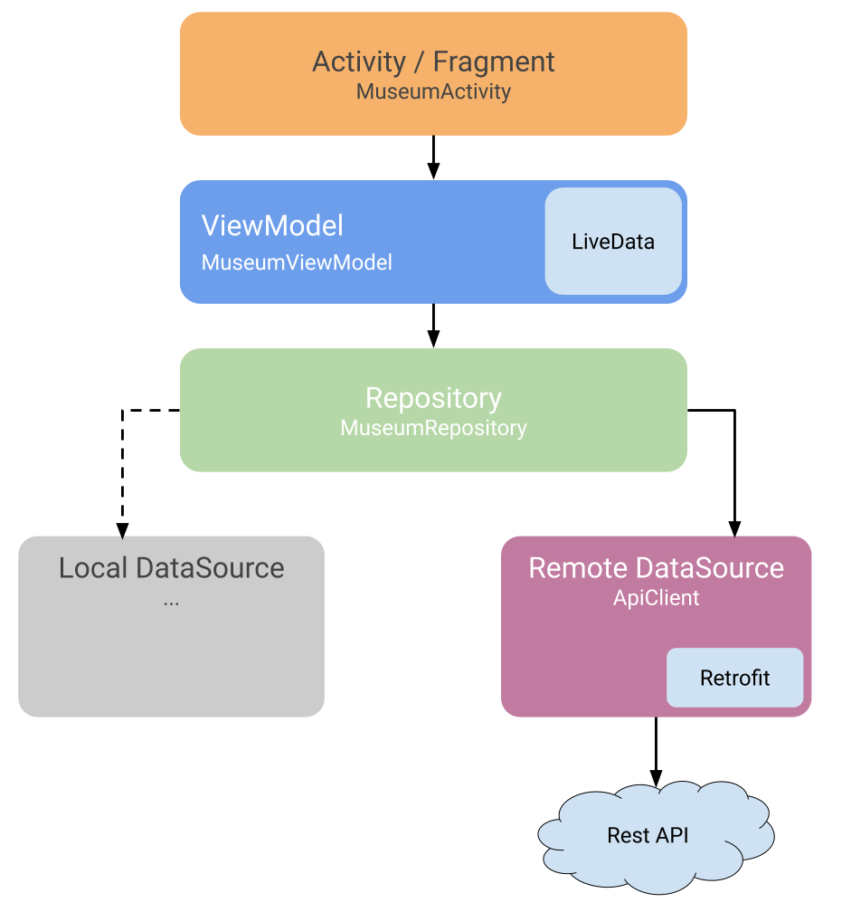

# User List App using kotlin-mvvm
Languages: [English](README.md)

  

MVVM(Model View ViewModel) sample in Kotlin using the components ViewModel, LiveData, the libraries Retrofit for network calls, Mockito for testing.

### MVVM Pattern (Model View ViewModel)
 

### Demo

### Architecture

 
### Libraries Used

- Dependency injection with Hilt, included android tests 
- Unit tests with Mockito and Robo electric 
- Data Binding for binding views and data
- Activity Ktx.
- Coroutines with retrofit and sealed classes to replace callbacks. Included testing with Coroutines.

### Dependencies

- Retrofit 2 [version: '2.3.0'](https://square.github.io/retrofit/)
- OkHttp 3 [version: '3.4.1'](https://square.github.io/okhttp/)
- Glide [version: '4.9.0'](https://github.com/bumptech/glide)
- AndroidX [version: '1.2.0'](https://mvnrepository.com/artifact/androidx)
- Arch Lifecycle [version: '2.2.0'](https://developer.android.com/jetpack/androidx/releases/lifecycle)
- Mockito [version: '2.27.0'](https://site.mockito.org/)
- Arch Testing [version: '2.1.0'](https://mvnrepository.com/artifact/android.arch.core/core-testing?repo=google)

### References

- ViewModel https://developer.android.com/topic/libraries/architecture/viewmodel
- LiveData https://developer.android.com/topic/libraries/architecture/livedata
- Android Architecture Blueprints https://github.com/googlesamples/android-architecture
- Android Jetpack: ViewModel https://www.youtube.com/watch?v=5qlIPTDE274
- Mockito : https://site.mockito.org/
- Unit Testing + Mockito + Kotlin + Architecture components https://medium.com/@marco_cattaneo/unit-testing-with-mockito-on-kotlin-android-project-with-architecture-components-2059eb637912
- Junit + LiveData https://jeroenmols.com/blog/2019/01/17/livedatajunit5/

### Contributing and reporting issues

If you want to contribute in this repository, please send me a pull request or if you want to report some issues.

I appreciate any question or comment. Also, if you consider it useful, you can give me a star ⭐ ⭐ ⭐.

